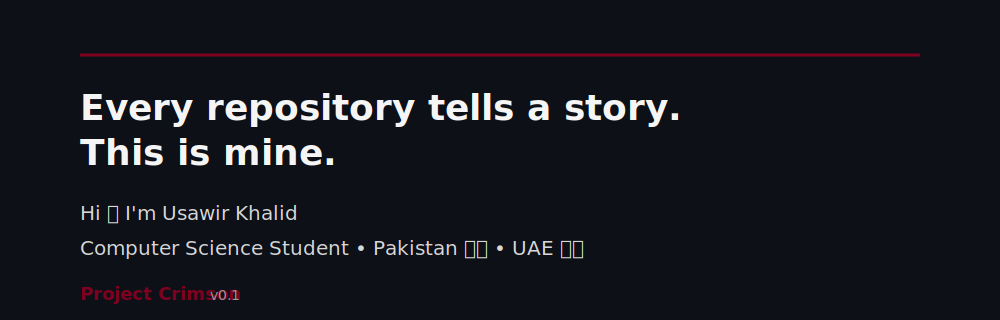

  

 

## 👩‍💻 About Me

- 🎓 Bachelor's student in Computer Science
- 💻 Passionate about Software Engineering and Full-Stack Development
- 🌱 Currently learning C++, Data Structures & Algorithms, Git & GitHub, MySQL, and Frontend Fundamentals (HTML, CSS & JavaScript)
- 🚀 Building practical projects to strengthen my software development and problem-solving skills
- 🎯 Seeking opportunities to grow through internships and real-world projects

---

## 🌱 The Journey

Every repository on this profile represents another step in my journey as a software developer.

My goal is to continuously learn, build meaningful projects, improve my technical skills, and document my progress along the way.

> **"Every repository tells a story. This is mine."**

---

## 📚 Currently Learning

- 💻 C++
- 🌳 Data Structures & Algorithms
- 🔀 Git & GitHub
- 🗄️ MySQL
- 🎨 Frontend Fundamentals (HTML, CSS & JavaScript)

---

## 🛠️ Languages & Tools

---

## 🎯 2026 Goals

- ✅ Build 10+ quality software projects
- ✅ Strengthen Data Structures & Algorithms
- ✅ Learn Frontend Development
- ✅ Explore Full-Stack Development
- ✅ Secure a Software Engineering Internship

---

## 👾 Coding Journey

Every contribution represents another step in my learning journey.

<picture>
  <source media="(prefers-color-scheme: dark)" srcset="https://raw.githubusercontent.com/Usawir-Khalid/Usawir-Khalid/pacman-output/pacman-contribution-graph-dark.svg">
  <source media="(prefers-color-scheme: light)" srcset="https://raw.githubusercontent.com/Usawir-Khalid/Usawir-Khalid/pacman-output/pacman-contribution-graph.svg">
  
</picture>

---

## 📬 Connect With Me

---

### Project Crimson v 1.0 ❤️

*"Every repository tells a story. This is mine."*

⭐ Thanks for visiting my profile! Feel free to explore my repositories and follow my journey as I continue learning and building.

### 💡 Favorite Quote

> *"The best way to predict the future is to create it."*

