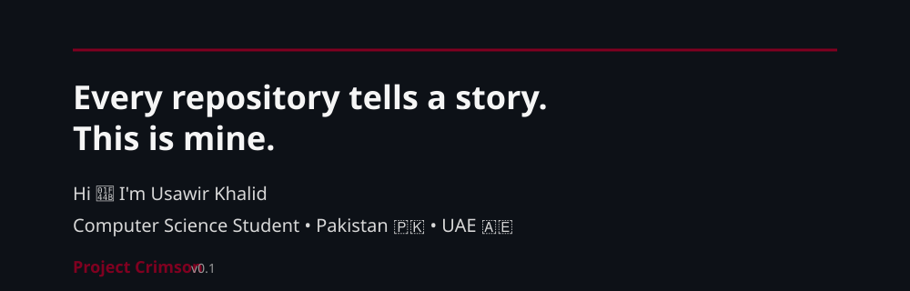

  

 

## 👩‍💻 About Me

- 🎓 Bachelor's student in Computer Science
- 💻 Passionate about Software Engineering and Full-Stack Development
- 📱 Currently focused on Flutter & Dart and Mobile App Development
- 🔥 Exploring Firebase, backend integration, and production-ready application development
- 🌱 Continuously strengthening Data Structures & Algorithms, Git & GitHub, MySQL, and software engineering fundamentals
- 🚀 Building practical projects to turn what I learn into real-world applications
- 🎯 Focused on growing my skills through real-world projects, collaboration, and continuous learning

---

## 🌱 The Journey

Every repository on this profile represents another step in my journey as a software developer.

From learning programming fundamentals to building Flutter applications, I'm continuously working on improving my technical skills, exploring new technologies, and turning ideas into meaningful projects.

My goal is to become a well-rounded software engineer who can design, build, and maintain high-quality applications.

> **"Every repository tells a story. This is mine."**

---

## 📚 Currently Learning

- 📱 Flutter & Dart
- 🔥 Firebase & Backend Integration
- 🌳 Data Structures & Algorithms
- 🔀 Git & GitHub
- 🗄️ MySQL
- 🌐 Full-Stack Development
- 🏗️ Software Engineering Fundamentals

---

## 🛠️ Languages & Tools

  
  
  
  
  
  
  
  
  

---

## 🎯 2026 Goals

- 🚀 Build 10+ quality software projects
- 📱 Build polished, production-ready Flutter applications
- 🔥 Gain hands-on experience with Firebase and backend development
- 🌳 Strengthen Data Structures & Algorithms
- 🌐 Expand my Full-Stack Development skills
- 🏗️ Improve software engineering and system design fundamentals
- 🤝 Gain experience working on real-world software projects
- 🌱 Contribute to meaningful open-source projects
- 💼 Continue growing as a Software Engineer

---

## 👾 Coding Journey

Every contribution represents another step in my learning journey.
I believe that consistency, curiosity, and building real projects are some of the best ways to become a better developer.

<picture>
  <source media="(prefers-color-scheme: dark)" srcset="https://raw.githubusercontent.com/Usawir-Khalid/Usawir-Khalid/pacman-output/pacman-contribution-graph-dark.svg">
  <source media="(prefers-color-scheme: light)" srcset="https://raw.githubusercontent.com/Usawir-Khalid/Usawir-Khalid/pacman-output/pacman-contribution-graph.svg">
  
</picture>

---

## 📬 Connect With Me

I'm always open to connecting with fellow developers, collaborating on interesting projects, and learning from others in the tech community.

---

### Project Crimson v 1.0 ❤️

*"Every repository tells a story. This is mine."*

⭐Thanks for visiting my profile! Feel free to explore my repositories and follow my journey as I continue learning, building, and growing as a software engineer.

### 💡 Favorite Quote

> *"The best way to predict the future is to create it."*

